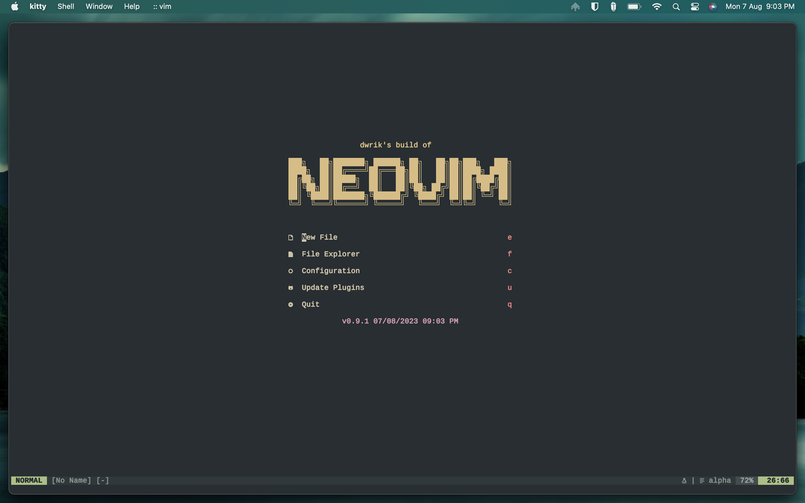

# Neovim Configuration

This repository contains my configuration for neovim to make it my personal development environment. The goal is to switch entirely to neovim to have a faster, entirely keyboard driven and more productive coding experience.

| Plugin                   | Description                               |
|:-------------------------|:------------------------------------------|
| bufferline               | buffer bar (top)                          |
| lualine                  | status bar (bottom)                       |
| treesitter               | syntax tree parser                        |
| lsp-zero                 | configure all things related to lsp       |
| lspkind                  | icons for lsp completion items            |
| telescope                | fuzzy finder                              |
| fzf native for telescope | faster algorithm for telescope            |
| nvim-tree                | file tree                                 |
| nvterm                   | terminal                                  |
| comment                  | comment shortcut                          |
| undotree                 | visualize vim's undo history              |
| gitsigns                 | git changes on sidebar                    |
| trouble                  | pretty list                               |
| zenmode                  | distraction free editing space            |
| alpha                    | home screen dashboard                     |
| fugitive                 | git plugin                                |
| delimitmate              | bracket completion                        |
| rose-pine & everforest   | colorschemes                              |
| vim-bbye                 | keep splits intact while deleting buffers |
| packer                   | plugin manager                            |

## Keybindings

- Check remaps in lua/dwrik/remaps.lua
- For plugin specific mappings, check the respective after/plugin/<plugin_name>.lua file
- For default mappings of plugins (for e.g. lsp-zero) check the help section

## Installation

1. Clone the repo
2. Run :PackerSync
3. Additionally, install required language servers using :Mason (see TODO in project)
4. Setup autocmds for code execution as required (see TODO in project)
