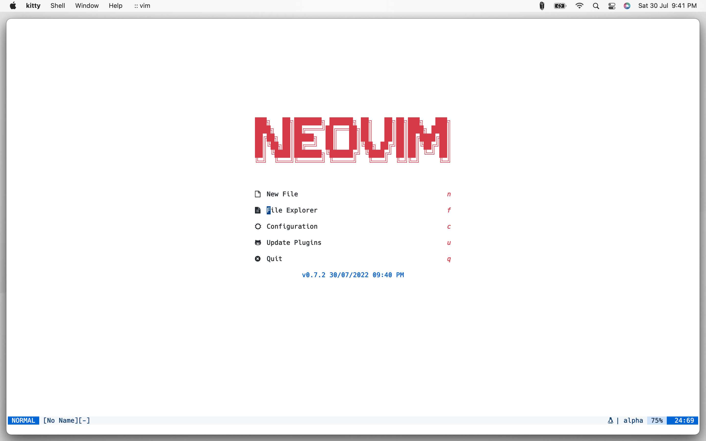

# Neovim Configuration

This repository contains my configuration for neovim to make it my primary development environment.

## Features

| Feature        | Plugins           |
| -------------- | ----------------- |
| Plugin Manager | packer            |
| Statusbar      | lualine           |
| Bufferbar      | bufferline        |
| Fuzzy Finder   | telescope         |
| Comments       | comment           |
| LSP Completion | coc               |
| File Explorer  | nvim-tree         |
| Terminal       | nvterm            |
| Syntax Parser  | nvim-treesitter   |
| Indent Lines   | indent-blankline  |
| Git Indicators | gitsigns          |
| Icons          | nvim-web-devicons |
| Dashboard      | alpha-nvim        |
| Colorscheme    | tokyonight        |

## Installation

1. Clone the repo
2. Open `lua/packer_init.nvim` file in neovim and save it. This is will automatically download and install all the required plugins.
3. Additionally install the required language servers using `:CocInstall <server name>`. Refer to the  [language server list](https://github.com/neoclide/coc.nvim/wiki/Language-servers) for a list of LSP server names.
